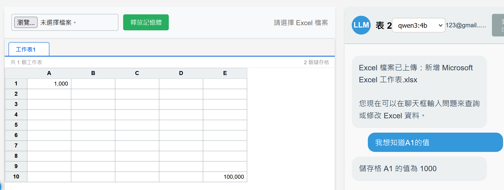
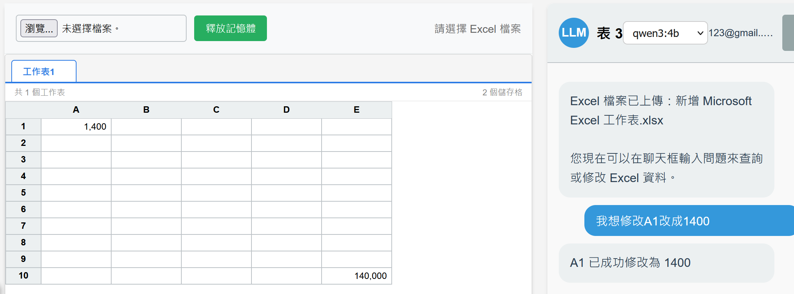

# Excel Agent Demo

> 一個用自然語言操作 Excel 的 LLM Agent，
> 從實習專案抽取核心架構，重新實作為可公開展示的版本。

---

## 這個專案在做什麼

讓使用者用自然語言操作 Excel 檔案——不需要懂公式、不需要點選欄位，
直接說「把 B2 改成 100」，Agent 就會執行。

**典型對話：**
- 「A1 的值是多少？」→ 讀取儲存格
- 「把 B2 改成 100」→ 寫入儲存格
- 「目前有哪些工作表？」→ 查詢結構

---

## 架構設計

```
Browser (SPA)
     │
     ▼
Flask API  ─── 注入工作表清單前綴，避免 LLM 幻覺
     │
     ▼
AIAgent.chat()  ─── tool-call loop，最多 5 輪
     │
     ├─ OllamaConnection  ──→  本地 qwen3（HTTP to localhost:11434）
     │        │ 回傳 tool_call
     │        ▼
     └─ ToolManager.execute_tool()
               │
               ▼
          ExcelTool（openpyxl）
               │ 寫入後觸發 LibreOffice headless 重算公式
               ▼
          Response → Browser（重新載入試算表）
```

**核心元件：**

| 元件 | 職責 |
|------|------|
| `AIAgent` | 驅動 tool-call loop，解析 `<think>` 標籤 |
| `OllamaConnection` | 與本地 Ollama 溝通，3 次 retry |
| `ToolManager` | 以 JSON Schema 宣告工具，統一派發執行 |
| `ExcelTool` | 封裝 openpyxl 操作，支援 fuzzy 欄位比對 |
| `ConversationManager` | 保留最近 10 輪對話，維持上下文 |

---

## 設計思路

### 為什麼用 Ollama 而不是 OpenAI？

原始情境是工廠端工程師修改敏感設定檔，資料不能傳到外部 API，
因此選用本地部署的 Ollama 確保資料不外流。
這個展示版延續同樣設計，也方便任何人在自己機器上跑起來。

### 為什麼把 Tool 跟 Agent 分離？

`ToolManager` 只負責「宣告工具清單」和「執行對應函數」，
`AIAgent` 只負責「送訊息給 LLM」和「解讀回應」。

這讓我能快速適配不同領域——同樣的 agent 核心，
把 tool 換掉就能做其他應用，不需要動推理邏輯。

### 為什麼選 SQLite 而不是記憶體？

對話記錄需要跨 session 保存，但這個規模不需要獨立的 DB server。
SQLite 省去部署複雜度，又能讓使用者重新整理頁面後還能繼續對話。

---

## 開發過程的取捨

### 問題 1：openpyxl 寫入後，公式欄位不會重算

openpyxl 以 `data_only=True` 讀取時，寫入後公式欄的快取值會被清空，
導致 IRR 等計算欄位顯示空白。

**解決方式：** 每次寫入後呼叫 LibreOffice headless 重跑一次計算，
再用另一個函數讀取更新後的數值。代價是每次修改多耗約 2 秒，
但確保使用者看到的數字一定是算過的結果。

### 問題 2：qwen3 的思考輸出混進了最終回應

qwen3 模型會在回應中夾帶 `<think>...</think>` 推理區段，
如果直接把全文顯示給使用者，畫面會出現一大段內部思考文字。

**解決方式：** 在 `AIAgent` 的回應後處理層，用 regex 把 `<think>` 區段全部剝除，
只保留 `</think>` 之後的正式回覆。

### 問題 3：使用者輸入欄位名稱時常有細微差異

使用者說「維護費」，表格裡是「設備維護費用」；
說「保險」，表格裡是「年保費」。完全比對就會找不到。

**解決方式：** 在 `ExcelTool` 用 `difflib.SequenceMatcher` 做 fuzzy 比對，
threshold 設 0.6，實測在中文短詞上的誤判率可接受。
匹配成功時會把實際使用的欄位名稱回傳給 LLM，讓回應更精確。

---

## 如何執行

### 環境需求
- Python 3.10+
- [Ollama](https://ollama.com)（本地安裝後 pull 一個模型）

### 安裝步驟

```bash
git clone https://github.com/platypus0103/excel-agent-demo
cd excel-agent-demo

# 建議用 uv
uv sync

# 或 pip
pip install -r requirements.txt
```

### 啟動

```bash
# 先確認 Ollama 有在跑
ollama serve
ollama pull qwen3:4b

# 啟動 web server（http://localhost:5000）
uv run python run.py

# 或 CLI 模式（純文字對話，適合快速測試）
uv run python main.py
```

---

## 功能展示

### 讀取操作


### 修改操作


---

## 技術棧

| 類別 | 使用工具 |
|------|---------|
| 語言 | Python 3.11 |
| Web 框架 | Flask |
| LLM | Ollama + qwen3:4b（本地） |
| Excel 處理 | openpyxl |
| 公式重算 | LibreOffice headless |
| 資料庫 | SQLite（SQLAlchemy） |
| Agent 框架 | 自行實作 |
| 前端 | Vanilla JS + Luckysheet |

---

## 備註

此 repo 為實習專案的概念驗證版本（PoC）。
原始程式碼因公司保密協議未公開，
此版本展示相同的架構設計與技術選型。
